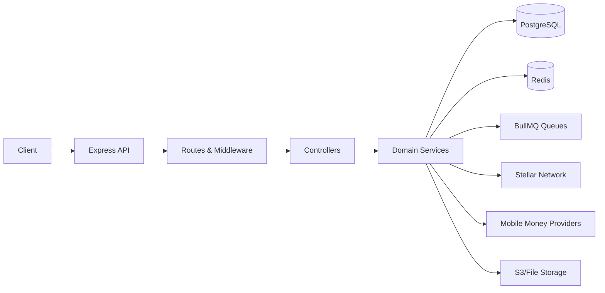
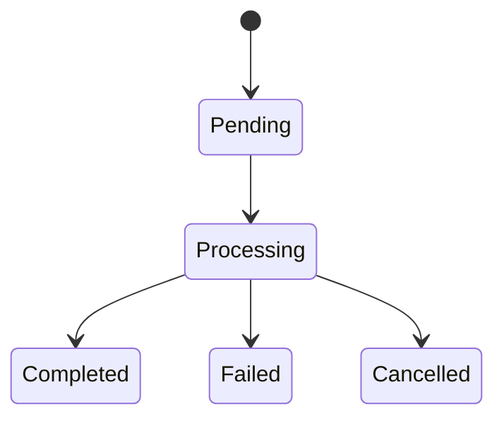
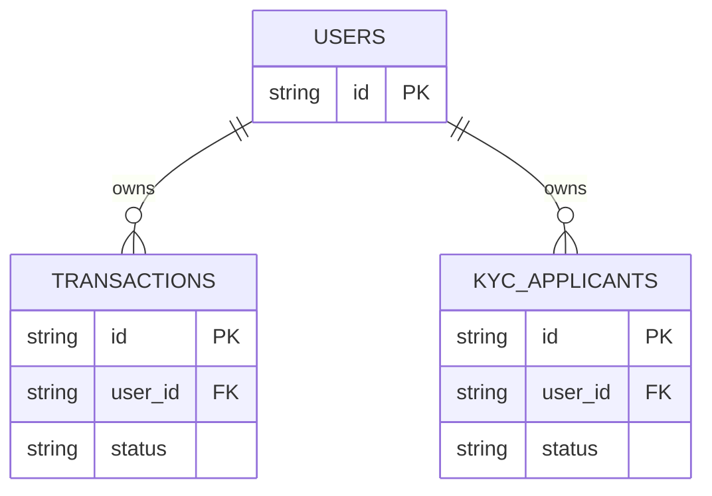

# Architecture Overview

This backend bridges mobile money providers with Stellar via REST/GraphQL APIs backed by PostgreSQL, Redis, and BullMQ for processing.

## Component Interaction

## Transaction State Machine

## Key Entities

